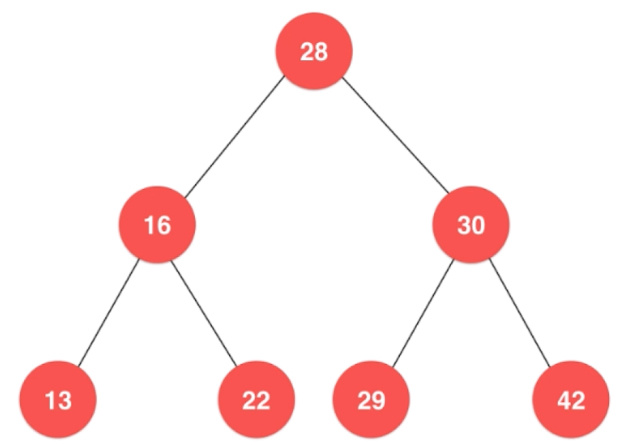
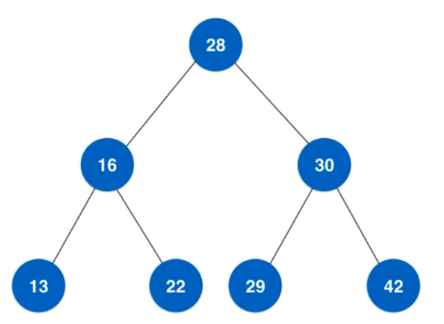

# 数据结构

是计算机中存储、组织数据的方式
数据结构意味着接口或封装：一个数据结构可被视为两个函数之间的接口，或者是由数据类型联合组成的存储内容的访问方法封装

## 线性表

最基本、最简单的一种数据结构，一个线性表是n个具有相同特性的数据元素的有限序列。

### 存储结构

线性表主要由顺序表示或链式表示

### Array（数组）

一种基本类型，其可以通过下标获取到对应位置的数据。
数组在内存中是一段连续的存储单元，每个数据依次放在每个单元中：

- 创建一个数组，必须声明其长度，这意味着数组的大小是固定的，无法动态调整大小。
- 想要获取数组中第i个元素，其时间复杂度是O(1)，因为可以根据其地址直接找到它。同理修改也是。
- 因为地址是连续，想要在数组中插入一个元素是复杂的，因为从插入位置起，后边的所有元素都需要向后移动一位。同理删除也是，只是移动的方向向前。并且数组满时，就无法继续插入
- 因为数组要占据一整块内存，有可能产生许多碎片，也可能因为找不到合适的内存块，而导致存储失败

### Linked List（链表）

链表是一种常见的基础数据结构，是一种线性表，但是并不会按线性的顺序存储数据，而是在每一个节点里存到下一个节点指针。
使用链表结构可以克服数组链表需要预先知道数据大小的缺点，链表结构可以充分利用计算机内存，实现灵活的内存动态管理。
链表即是由节点(Node)组成的线性集合，每个节点可以利用指针指向其他节点。它是一种包含了多个节点的，能够用于表示序列的数据结构。

根据指针域的不同，链表分为单链表、双向链表、循环链表等

- 声明一个链表时，不需要知道其长度，也不需要连续的内存块，所以其大小可以动态调整
- 链表的每个元素分为数据域和指针域，前者是实际存储的数据，后者则指向下一个元素的地址。和数组相比，每个元素需要占用内存更大了
- 要获取链表的第i个元素变得复杂，因为其地址存放在它上一个元素的指针域，所以只能从第一个元素起，进行i次操作
- 链表对查询表现也一般，需要遍历，时间复杂度为O(n)

#### 缺点

丧失了随机访问的能力。不能像数组一样，给定一个索引直接拿出对应元素。底层机制中数组开辟的空间再内存中是连续分布的，可以直接寻找索引对应的偏移，直接计算出数据所存储的内存地址，直接用O(1)复杂度拿出。链表靠next连接，每个节点存储地址不同

数组与链表的选择：

- 数组按照位置查找迅速，链表增删方便
- 数组是固定大小，链表可以随时扩充与缩减
- 链表每个元素占据内存略多与数组
- 数组和链表在查询方面表现都比较一般，耗时较长

#### 链表的基本操作

- 在链表头添加元素

    ```java
    final Node<E> newNode = new Node<>(e)
    newNode.next = head
    head = newNode
    ```

- 在索引2的地方添加元素（只有索引1才知道索引2）

    ```java
    Node prevNode = head;
    for (int i = 0; i < index-1; i++) {
        prevNode = prevNode.next;
    }
    Node newNode = new Node()
    newNode.next = prevNode.next;
    prevNode.next = newNode;
    ```

- 获取元素操作

    ```java
    Node<E> x = first;
    for (int i = 0; i < index; i++)
        x = x.next;
    return x;
    ```

- 删除元素
    删除索引为2位置的元素

    ```java
    //找到它之前的节点，next 设置 下一个
    prev.next = delNode.next
    delNode.next = null
    ```

    想要改变链表

#### 链表的应用

链表用来构建许多其他数据结构，如堆栈，队列和他们的派生
节点的数据域也可以成为另一个链表，通过这种手段，可以用列表来构建许多链性数据结构

- 单向链表：
    链表中最简单的一种是单向链表，它包含两个域，一个信息域和一个指针域。这个链接指向列表的下一个节点，而最后一个节点则指向一个空值

    一个单链表的节点被分为两个部分。第一个部分保存或者显示关于节点的信息，第二部分存储下一个节点的地址。

    ```java
    class Node {
        int data;
        Node next;

        Node(int d) {
            data = d;
            next = null;
        }
    }
    ```

- 双向链表：
    每个节点有两个连接：一个指向前一个节点(当此“连接”时，指向空值或者空列表)；而另一个指向下一个节点(当此“连接”时，指向空值或者空列表)

    ```java
    class Node {
        private Node previous;//前驱节点
        private Node next; //后继节点
        private E e; //泛型元素
        public Node(Node previous, Node next, E e) {
            this.previous = previous;
            this.next = next;
            this.e = e;
        }
    }
    ```

- 循环链表：
    首节点和末节点被连接在一起

    ```java
    public class LinkedList {
        private Node head;
        private Node tail;
        int size;

        public LinkedList() {
            tail = head = null;
            size = 0;
        }

        public void addHead(Node hd) {
            if (size == 0) {
                hd.next = hd;
                tail = head = hd;
                size++;
            } else {
                tail.next = hd;
                hd.next = head;
                size++;
            }
        }

        public void addTail(Node tl) {
            if (size == 0) {
                tl.next = tl;
                tail = head = tl;
                size ++
            } else {
                tail.next = tl;
                tl.next = head;
                tail = tl;
                size++;
            }
        }
    }
    ```

- 时间复杂度：
|操作|时间复杂度|
|:--:|:--:|
|增加/只对表头操作|O(n)/O(1)|
|删除/只对表头操作|O(n)/O(1)|
|修改|O(n)|
|查询|O(n)|

### Stack（栈）

栈也是一种线性结构；相比数组，栈对应的操作是数组的子集；只能从一端添加元素，也只能从一端取出元素（这一端称之为栈顶）
栈是一种后进先出的数据结构。Last In First Out

```java
Deque<Integer> stack = new ArrayDeque<Integer>();
stack.size();
```

JDK doc建议使用Deque代替Stack实现栈，因为Stack继承自Vecotor，需要synchronized，性能略低

比较Stack和Deque方法

|Stack方法|等效的Deque方法|
|:--:|:--:|
|push(e)|addFirst(e)|
|pop()|remoreFirst()|
|peek()|getFirst()|

- 栈是元素的集合，其包含了两个基本操作：push操作可以用于将元素压入栈，pop操作可以将栈顶元素移除。
- 遵循后入先出(LIFO)原则
- 时间复杂度：
  - 索引:(O(n))
  - 搜索:(O(n))
  - 插入:(O(1))
  - 移除:(O(1))

### Queue

队列是一种特殊的线性表，相比数组，队列对应的操作是数组的子集
它只允许在表的前端(front)进行删除操作，而在表的后端(rear)进行插入操作。（First In First Out）
进行插入操作的端称为对尾，进行删除操作的端称为对头。对列没有元素时，称为空队列

- 队列是元素的集合，其包含了两个基本操作；enqueue操作可以用于将元素插入到队列中，而dequeeu操作则是将元素从队列中移除。
- 遵循先入先出原则(FIFO)。
- 时间复杂度：
  - 索引:(O(n))
  - 搜索:(O(n))
  - 插入:(O(1))
  - 移除:(O(1))

1. ConcurrentLinkedQueue
    是一个基于连接节点的无界线程安全队列
    `add()`和`offer()`都是加入元素的方法(在ConcurrentLinkedQueue中，这两个方法没有任何区别)
    `poll()`和`peek()`都是取头元素节点，区别在于前者会删除元素，后者不会

2. BlockingQueue
    - ArrayBlockingQueue
    基于数组的阻塞队列实现，在ArrayBlockingQueue内部，维护了一个定长数组，以便缓存队列中的数据对象，其内部没实现读写分离
    也就意味着生产和消费不能完全并行，长度是需要定义的，可以指定先进先出或者先进后出，也叫有界队列。

        |操作|抛出异常|返回个特殊值|阻塞到队列可用|一定时间后退出|操作方式|
        |:---:|:---:|:----:|:---:|:---:|:----:|
        |添加元素|add(e)|offer(e)|put(e)|offer(e,time,unit)|添加到对尾|
        |移除元素|remove(e)|poll(e)|take()|poll(e,time,unit)|获取头元素并移除|
        |查询元素|element(e)|peek(e)|无|无|获取头元素不移除|

    - LinkedBlockingQueue
    基于链表的阻塞队列，同ArrayBlockingQueue类似，其内部也是维护着一个数据缓冲池队列(链表)，LinkedBlockingQueue之所以能够高效的处理并发数据，是因为其内部实现采用分离锁(读写分离两个锁)，从而实现生产者和消费者操作的完全并行运行。它是一个无界队列

    - PriorityBlockingQueue
    基于优先级的阻塞队列(优先级的判断通过构造函数传入的Compator对象来决定，也即是说传入队列的对象必须实现Comparable接口)，在实现PriorityBlockingQueue时，内部控制线程同步的锁采用的是公平锁，他也是一个无界队列。add()并不进行排序操作，只有在取数据时才进行排序

    - DelayQueue
    带有延迟时间的queue，其中的元素只有当其指定的延迟时间到了，才能够从队列中获取到该元素
    DelayQueue中的元素必须实现Delayed接口，DelayQueue是一个没有大小限制的队列，应用场景很多，比如对缓存超时的数据进行移除、任务超时处理、空闲连接的关闭等等

    - SynchronousQueue
    一种没有缓冲的队列，生产者产生的数据直接被消费者获取并消费
    它模拟的功能类似于生活中一手交钱一手交货这种情形，像那种货到付款或者先付款后发货模型不适合使用SynchronousQueue。首先要知道SynchronousQueue没有容纳元素的能力，即它的isEmpty()方法总是返回true，但是给人的感觉却像是只能容纳一个元素

## Tree

是一种无向图，其中任意两个顶点间存在唯一一条路径，或者说，只要没有回路的连通图就是树。



### Binary Tree

二叉树是一种典型的树结构


- 二叉树即是每个节点最多包含左子节点与右子节点这两个节点的树形数据结构，通常分支被称作“左子树”和“右子树”。二叉树的分支具有左右次序，不能颠倒
    
   |完美二叉树|Perfect Binary Tree|除了叶子节点之外的每一个节点都有两个孩子，每一层(当然包含最后一层)都被完全填充|A Perfect Binary Tree(PDT) is a tree with all leaf nodes at the same depth. All internal nodes have degree 2.|每一层的度都为2|
   | :---: | :-----------------: | :------------------: |:--:|:--:|
   | 完全二叉树 | Complete Binary Tree | 除了最后一层之外的其他每一层都被完全填充，并且所有结点都保持左对齐 |A Complete Binary Tree(CBT) is binary three in which every level, excepte possibly the last, is completely filled, and all nodes are as far left as possible|从根节点到倒数第二层满足完美二叉树，最后一层可以不完全填充，其叶子节点都靠左对齐|
   | 完满二叉树 | Full/Strictly Binary Tree | 除了叶子结点之外的每一个结点都有两个孩子结点 |A Full Binary Tree(FBT) is a tree in which every node other than the leaves has two children|所有非叶子节点的度都是2|

### 存储二叉树

二叉树和链表一样，动态数据结构

#### 顺序存储（数组存储）

二叉树可以用数组来存储，尤其是完美二叉树

#### 二叉链表存储

```java
class Node {
    private int value; //二叉树的值
    private Node leftChild; //左孩子节点
    private Node rightChild; //右孩子节点

    public(int value, Node leftChild, Node rightChild) {
        this.value = value;
        this.leftChild = leftChild;
        this.rightChild = rightChild;
    }
}
```

### Binary Search Tree

- 二叉搜索树(BST)是一种特殊的二叉树，其任何节点中的值都会大于或者等于其左子树中存储的值并且小于或者等于其右子树中存储的值。
- 时间复杂度：
  - 索引:O(log(n))
  - 搜索:O(log(n))
  - 插入:O(log(n))
  - 删除:O(log(n))

如果是自定义对象想要使用二分搜索树，需要自定义好两个学生是如何进行比较的，想要加快搜索就要对于数据有一定的要求

#### 向二分搜索树添加元素

```java
private Node add(Node node, T elem) {
    if (node == null) {
        node = new Node(null, null, elem);
    } else {
        if (elem.compareTo(node.data) < 0) {
            node.left = add(node.left, elem);
        } else {
            node.right = add(node.right, elem);
        }
    }
    return node;
}
```

#### 二分搜索搜的遍历

##### 什么是遍历

遍历操作就是把所有节点都访问一遍；访问的原因和业务相关；

- 深度优先遍历
  前序、中序、后序遍历的非递归实现
- 广度优先遍历
  层序遍历，一般采用非递归方式，使用队列实现

#### 二分搜索树的前序遍历

前序遍历顺序：是指先访问根，再访问左右

- 非递归写法
    
    1. 初始根节点压入栈
    2. 出栈访问28
    3. 压入它的右孩子30，左孩16。
    4. 访问栈顶16
    5. 压入它的右左孩子

#### 中序遍历

中序遍历为：左根右

#### 后序遍历

左右根

#### 广度优先遍历

意义：更快的找到问题的解，算法的实现在一棵虚拟的树上搜索，常用语算法设计中-最短路径

#### 二分搜索树的删除操作

##### 删除最小值、最大值

最小值位于整棵树最左下角，最大值位于整棵树的最右下角


```java
private Node findMin(Node node) {
    while(node.left != null) {
        node = node.left;
    }
    return node;
}
```

```java
private Node findMax(Node node) {
    while(node.right != null)
      node = node.right;
    return node;
}
```


#### 搜索

##### 广度优先搜索

广度优先搜索算法（Breadth-First-Search），是一种图形搜索算法，简单来说，BFS从根节点开始，沿着树的宽度遍历树的节点。如果所有节点均被访问，则算法中止。

实现方法：

1. 首先将根节点放入队列中
2. 从队列中取出第一个节点，并检验它是否为目标
  - 如果找到目标，则结束搜索并回传结果
  - 否则将它所有尚未检验过的直接子节点加入队列
3. 若队列为空，表示整张图都检查过了-即图中没有要搜索的目标。结束搜索并回传“找不到目标”
4. 重复步骤2

## Trie

* 字典树，又称基数或者前缀树，能够用于存储键为字符串的动态集合或者关联数组的搜索树。树中的节点并没有直接存储关键键值，而是该节点
  在树中挂载位置决定了其关联键值。某个节点的所有子节点都拥有相同的前缀，整棵树的根节点则是空字符串。

## Fenwick Tree

* 树状数组又称Binary Indexed Tree，其表现形式为树，不过本质上是以数组实现。数组中的下标代表着树种的顶点，每个顶点的父节点或者子节点
  的下标能够通过位运算或得

## Heap

* 堆是一种特殊的满足某些特性的数据结构，整个堆中的所有的父子节点的键值都会满足相同的排序条件。堆更准确可以分为最大堆和最小堆，在最大堆中，
  父节点的键值永远大小或者等于子节点的值，并且整个堆中的最大值存储与根节点；而最小堆中，父节点的键值永远小鱼或者等于其子节点的键值，并且
  整个堆中的最小值存储与根节点。
* 时间复杂度：
    * 访问:O(log(n))
    * 搜索:O(log(n))
    * 插入:O(log(n))
    * 移除:O(log(n))
    * 移除最大值/最小值:O(1)

    

## Hashing

哈希表就是通过关键字来获取数据的一种数据结构，它通过把关键字映射为表中的位置来获取元素，这种映射主要使用Hash函数

Hash函数，实际上是建立起key与int值映射关系的函数。好比身份证号一样。
哈希表，就是一个数组，只是其元素不是按照数组的规则排列的。任何一个元素要放进哈希表，都必须先通过Hash函数获取一个int数值，这个数值经过处理后将作为它的存放位置，然后这个元素才能放进哈希表中。
哈希表完全继承了数组的优点，又显著的提高了查询的速度，又显著的提高了查询的速度，但有一个缺陷，这就是哈希碰撞

- 哈希能够将任意长度的数据映射到固定长度的数据。哈希函数返回的即是哈希值，如果两个不同的键得到相同的哈希值，即将这种现象称为碰撞。
- Hash Map:HashMap是一种能够建立起键与值之间关系的数据结构，HashMap能够使用哈希函数将键转化为桶或者槽中的下标，
  从而优化对于目标值得搜索速度。

  碰撞解决
  - 链地址法(Separate Chaining)：链地址法中，每个桶是相互独立的，包含了一系列-引的列表。搜索操作的时间复杂度即是搜索桶的时间与遍历列表的时间之和。
  - 开地址法(Open Addressing)：在开地址法中，当插入新值时，会判断该值对应的哈希桶是否存在，如果存在则根据某种算法依次选择下一个可能的位置，直到找到一个尚未被占用的地址。所谓开地址也是指某个元素的位置并不永远由哈希值决定。
  
### 哈希碰撞

无论什么对象，都根据一个规则映射为一个int值。被转换的对象有无数种可能，但是int的值是有限的，这样必然会有不同的对象，映射到相同的int值，这就是所谓的哈希碰撞。发生碰撞之后，单纯的一维数组已经无法满足需求了

比较通用的方法，就是使用数组+链表组合的方式。当出现哈希碰撞时，在该位置的数据就通过链表的方式链接起来

JDK1.7及之前的版本，HashMap的存储结构和上图是一致的，JDK1.8之后还加入了红黑树进一步优化

哈希表是一种优化存储的思想，具体存储元素的依然是其他的数据结构。设计良好的哈希表，能同时兼备数组和链表的优点，它能在插入和查找时都具备良好的性能。然而设计不好的哈希表，有可能会出现较多的哈希碰撞，导致链表过长，从而哈希表会更像一个链表。还有当数据量很大时，为防止链表过长，就需要对数组进行扩容，这时就涉及到了数组的拷贝，其对性能的影响也很严重，所以需要提前对可能的情况有良好的预测，才能真正发挥哈希表的优势

## 递归

递归（Recurision），指一种通过重复将问题分解成同类的子问题而解决问题的方法。递归方式可以被用于解决很多的计算机科学问题。

递归的强大之处在于它允许用户有限的语句描述无限的对象

所有的递归算法可以分为两步，第一步是求解基本问题（基线问题），第二步是核心，把原问题化未更小的问题，使用更小的问题构建原问题（递归问题）。

## 动态规划

动态规划（Dynamic programming）：通过把原问题分解为相对简单的子问题的方式求解复杂问题的方法。
动态规划常常适用于重叠子问题和最优子结构性质的问题，动态规划方法所耗时间往往远少于朴素解法。

### 使用情况

1. 最优子结构性质。如果问题的最优解所包含的子问题的解也是最优的，就称该问题具有最优子结构性质（即满足最优原理）。最优子结构性质为动态规划算法解决问题提供了重要线索。
2. 无后效性。即子问题的解一旦确定，就不再改变，不受在这之后、包含它的最大的问题的求解决策影响。
3. 子问题重叠性质。子问题重叠性质是指在用递归算法自顶向下对问题进行求解时，每次产生的子问题并不总是新问题。有些子问题会被重复计算多次。动态规划算法正是利用了这种子问题的重叠性质，对每一个子问题只计算一次，然后将其计算结果保存在一个表格中，当再次需要计算依据计算过的子问题时，只是在表格中简单地查看一下结果，从而获得较高的效率。
